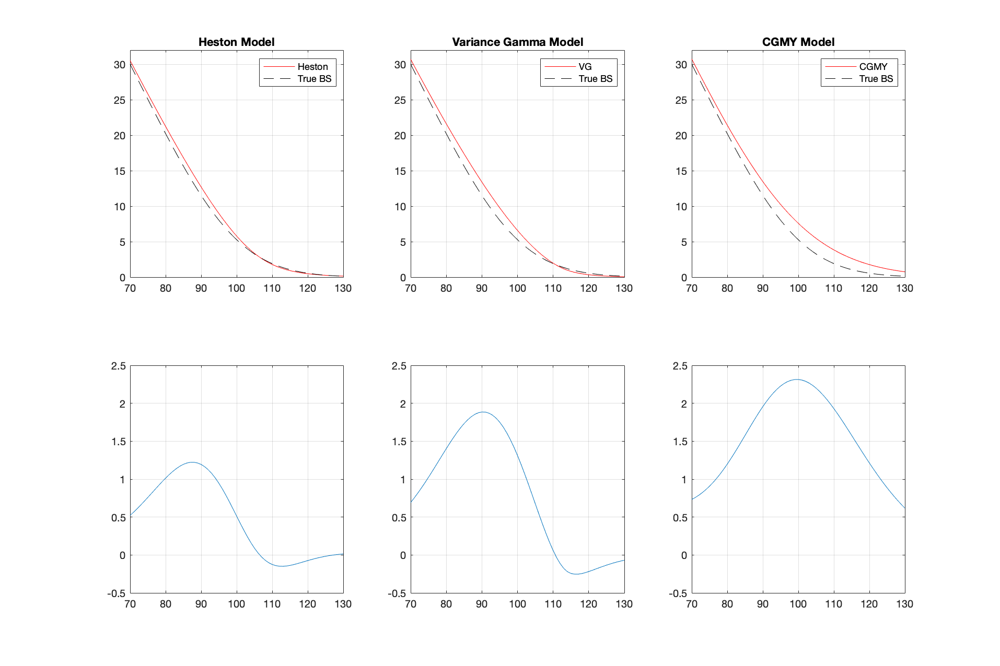

Advanced Numerical Methods and Data Analysis - FS19-8,780
 
University of St. Gallen, 24.03.2019
 

-------------

# Option Pricing using the Cosine Fast Fourier Transform Method

**Federico Baldi Lanfranchi** &nbsp; &nbsp; &nbsp; &nbsp; &nbsp; &nbsp; &nbsp; federico.baldilanfranchi@student.unisg.ch  
**Peter la Cour** &nbsp; &nbsp; &nbsp; &nbsp; &nbsp; &nbsp; &nbsp; &nbsp; &nbsp; &nbsp; &nbsp; &nbsp; &nbsp; &nbsp; &nbsp; &nbsp; &nbsp; &nbsp;peter.lacour@student.unisg.ch

## 
<a href="#0">Overview</a>

1. <a href="#2">Introduction</a>
2. <a href="#A2">Description of the Cos-FFT Method</a>
3. <a href="#B2">Characteristic Functions</a>
	* <a href="#BB1">Heston Model Characteristic Functions</a>
	* <a href="#BB2">Variance Gamma Model Characteristic Functions</a>
	* <a href="#BB3">CGMY Model Characteristic Functions</a>
4. <a href="#C2">Distributional Characteristics of the different Models</a>
5. <a href="#D2">Pricing Accuracy of the Cos-FFT Method</a>
8. <a href="#E2">Concluding Remarks</a>

## 
 <a href="#0">Introduction  </a> 

## 
 <a href="#0">Description of the Cos-FFT Method</a> 

<a href="#0">Back to top</a> 

## 
 <a href="#0">Characteristic Functions</a> 

### 
 Heston Model 

### 
 Variance Gamma Model 

### 
 CGMY Model 

<a href="#0">Back to top</a> 

## 
 <a href="#0">Distributional Characteristics of the different Models</a> 

<a href="#0">Back to top</a> 

## 
 <a href="#0">Pricing Accuracy of the Cos-FFT Method</a> 

<a href="#0">Back to top</a> 

<a href="#0">Back to top</a> 

## 
 <a href="#0">Concluding Remarks</a> 

<a href="#0">Back to top</a> 
